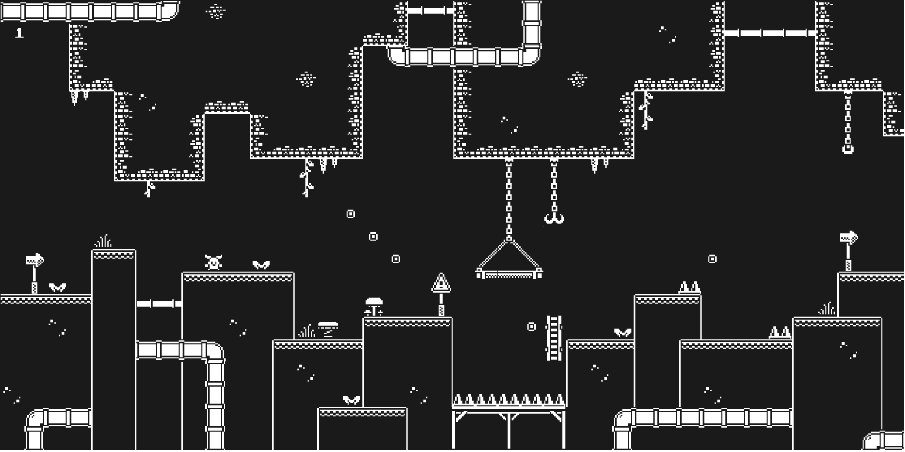

 

  <h3 align="center">Super Game</h3>

  

    Minigame construído com typescript
  

  
Índice

  <ol>
    <li>
      <a href="#sobre-o-projeto">Sobre o projeto</a>
      <ul>
        <li><a href="#construido-com">Construido com</a></li>
      </ul>
    </li>
    <li><a href="#contato">Contato</a></li>
  </ol>

## Sobre o projeto

Esse repositório é um pequeno jogo. Construído com o objetivo de experimentar a biblioteca Kaboomjs.

### Construído com

O projeto foi construído utilizando

- [Bit Platformer Pack](https://kenney.nl/assets/bit-platformer-pack)
- [Kaboomjs](https://kaboomjs.com/)
- [TypeScript](https://www.typescriptlang.org)
- [Webpack](https://webpack.js.org/)

## Contato

William James - william.james.pj@gmail.com

Link do projeto: [https://github.com/william-james-pj/superGame](https://github.com/william-james-pj/superGame)
